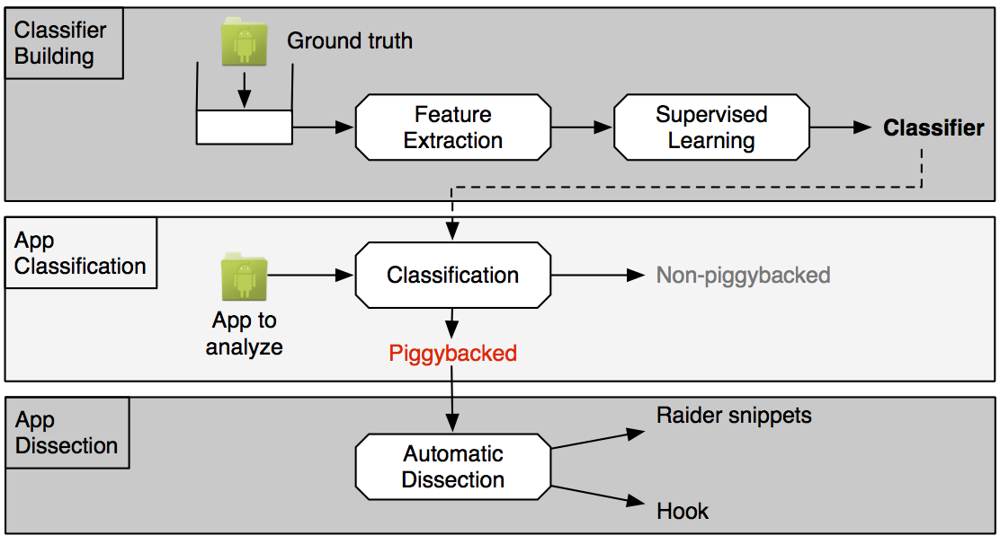
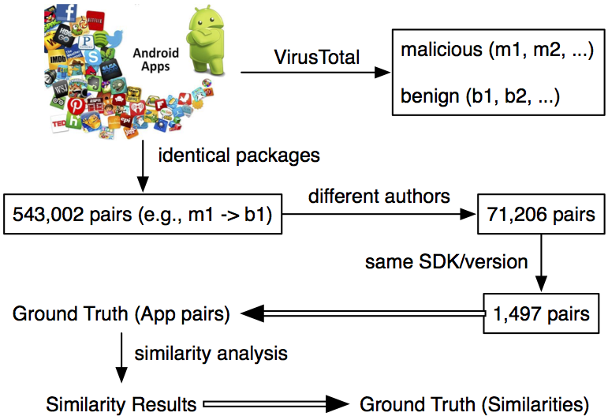

# Piggybacking Dissection

To devise efficient approaches and tools for detecting ma- licious code in the Android ecosystem, researchers are in- creasingly required to have deep understanding of malware. There is thus a need to provide a framework for dissecting malware and localizing malicious program fragments within app code in order to build a comprehensive dataset of ma- licious samples. In this paper we address this need with an approach for listing malicious packages in an app based on code graph analysis. To that end we focus on piggybacked apps, which are benign apps repackaged with malicious pay- load. Our approach classifies each app independently from its potential clones based on machine learning, and detects piggybacked apps with a precision of about 97%. With the built classifier we were also able to find new piggybacked apps in market datasets, outside our ground truth. We also identify malicious packages with a precision@5 and recall@5 of 83% and the hook code with a precision@1 and recall@1 of around 68%. We further demonstrate the importance of collecting malicious packages by using them to build a per- formant malware detection system.

## Approach

The following figure illustrates the main steps of our approach. 
We rely on the ground truth (which we will show in the following section) to build a  
machine learning classifier which will be applied for a given app to detect if this app is a piggybacked malware app or not. Then, if an app is flagged as piggybacked we statically analyze it to extract features on its constituting parts to distinguish the raider and hook code from the carrier code. The output of this step is a list of packages ranked with a probability score of maliciousness.

## Ground Truth

We have collected a set of original:piggybacked app pairs, which are currently available under the dataset directory.

1. all-pairs: showing the whole ground truth we build for piggybacked apps.
2. pairs-with-new-methods: showing the similarity of the pair of apps, where the piggybacked apps have introduced new methods into the original apps.

The ground truth build process is shown in the following figure.

More things will come soon...
